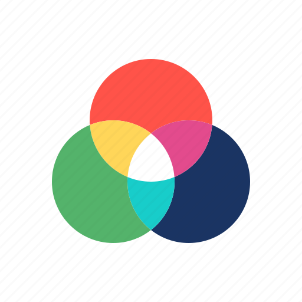
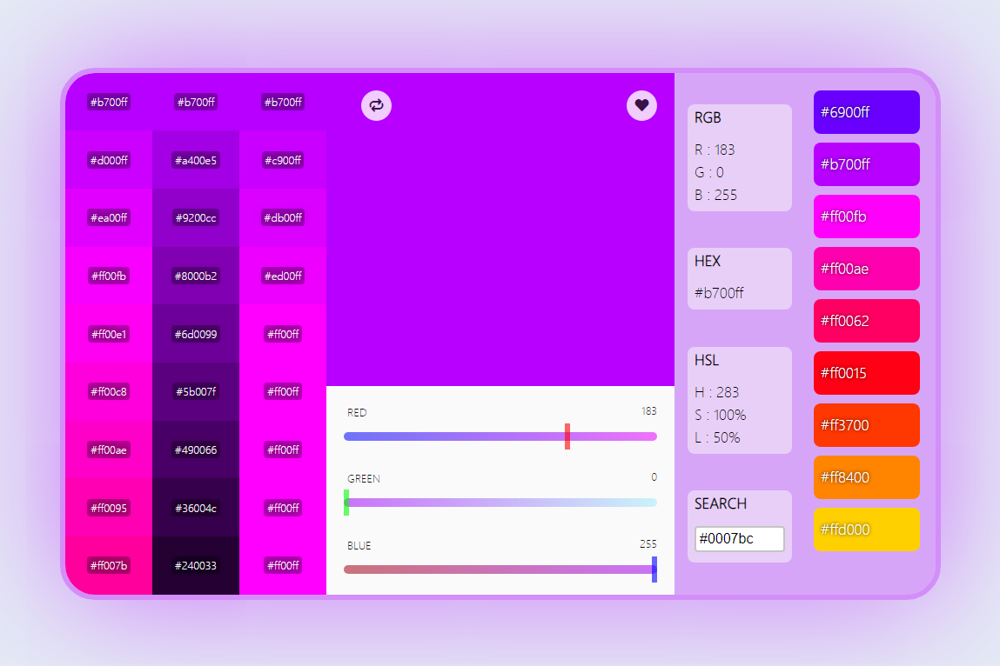

[![Contributors][contributors-shield]][contributors-url]
[![Forks][forks-shield]][forks-url]
[![Stargazers][stars-shield]][stars-url]
[![Issues][issues-shield]][issues-url]
[![MIT License][license-shield]][license-url]
[![LinkedIn][linkedin-shield]][linkedin-url]

<!-- PROJECT LOGO -->
 

  

  <h3 align="center">COLOR PICKER APP</h3>

  

    Pick and save your favorite color
     
    <a href="https://github.com/miladxdev/color-picker-app"><strong>Live preview »</strong></a>
     
     
    <a href="https://miladxdev.github.io/color-picker-app">View Demo</a>
    ·
    <a href="https://github.com/miladxdev/color-picker-app/issues">Report Bug</a>
    ·
    <a href="https://github.com/miladxdev/color-picker-app/issues">Request Feature</a>
  

<!-- TABLE OF CONTENTS -->

  
Table of Contents

  <ol>
    <li>
      <a href="#about-the-project">About The Project</a>
      <ul>
        <li><a href="#built-with">Built With</a></li>
      </ul>
    </li>
    <li>
      <a href="#getting-started">Getting Started</a>
      <ul>
        <li><a href="#prerequisites">Prerequisites</a></li>
        <li><a href="#installation">Installation</a></li>
      </ul>
    </li>
    <li><a href="#usage">Usage</a></li>
    <li><a href="#roadmap">Roadmap</a></li>
    <li><a href="#contributing">Contributing</a></li>
    <li><a href="#license">License</a></li>
    <li><a href="#contact">Contact</a></li>
    <li><a href="#acknowledgements">Acknowledgements</a></li>
  </ol>

<!-- ABOUT THE PROJECT -->

## About The Project

`screenshot`

### [LIVE DEMO ☝](https://miladxdev.github.io/color-picker-app)

This singel page application alows you to pick RGB colors and then get RGB/HEX/HSL color codes and also save your favorite color locally. 🎨

### Built With

- `HTML`
- `CSS`
- `JAVASCRIPT`

<!-- ROADMAP -->

## Roadmap

See the [open issues](https://github.com/miladxdev/color-picker-app/issues) for a list of proposed features (and known issues).

<!-- CONTRIBUTING -->

## Contributing

Contributions are what make the open source community such an amazing place to be learn, inspire, and create. Any contributions you make are **greatly appreciated**.

1. Fork the Project
2. Create your Feature Branch (`git checkout -b feature/AmazingFeature`)
3. Commit your Changes (`git commit -m 'Add some AmazingFeature'`)
4. Push to the Branch (`git push origin feature/AmazingFeature`)
5. Open a Pull Request

<!-- LICENSE -->

## License

Distributed under the MIT License. See `LICENSE` for more information.

<!-- CONTACT -->

## Contact

Milad Gharibi - [@twitter](https://twitter.com/your_username) - miladxgh@gmail.com

Project Link: [https://github.com/miladxdev/color-picker-app](https://github.com/miladxdev/color-picker-app)

<!-- ACKNOWLEDGEMENTS -->

## Acknowledgements

- [GitHub Emoji Cheat Sheet](https://www.webpagefx.com/tools/emoji-cheat-sheet)
- [Img Shields](https://shields.io)
- [Choose an Open Source License](https://choosealicense.com)
- [GitHub Pages](https://pages.github.com)
- [Font Awesome](https://fontawesome.com)

<!-- MARKDOWN LINKS & IMAGES -->
<!-- https://www.markdownguide.org/basic-syntax/#reference-style-links -->

[contributors-shield]: https://img.shields.io/github/contributors/miladxdev/color-picker-app.svg?style=for-the-badge
[contributors-url]: https://github.com/miladxdev/color-picker-app/graphs/contributors
[forks-shield]: https://img.shields.io/github/forks/miladxdev/color-picker-app.svg?style=for-the-badge
[forks-url]: https://github.com/miladxdev/color-picker-app/network/members
[stars-shield]: https://img.shields.io/github/stars/miladxdev/color-picker-app.svg?style=for-the-badge
[stars-url]: https://github.com/miladxdev/color-picker-app/stargazers
[issues-shield]: https://img.shields.io/github/issues/miladxdev/color-picker-app.svg?style=for-the-badge
[issues-url]: https://github.com/miladxdev/color-picker-app/issues
[license-shield]: https://img.shields.io/github/license/miladxdev/color-picker-app.svg?style=for-the-badge
[license-url]: https://github.com/miladxdev/color-picker-app/blob/master/LICENSE.txt
[linkedin-shield]: https://img.shields.io/badge/-LinkedIn-black.svg?style=for-the-badge&logo=linkedin&colorB=555
[linkedin-url]: https://www.linkedin.com/in/milad-gharibi-507ba3214/
